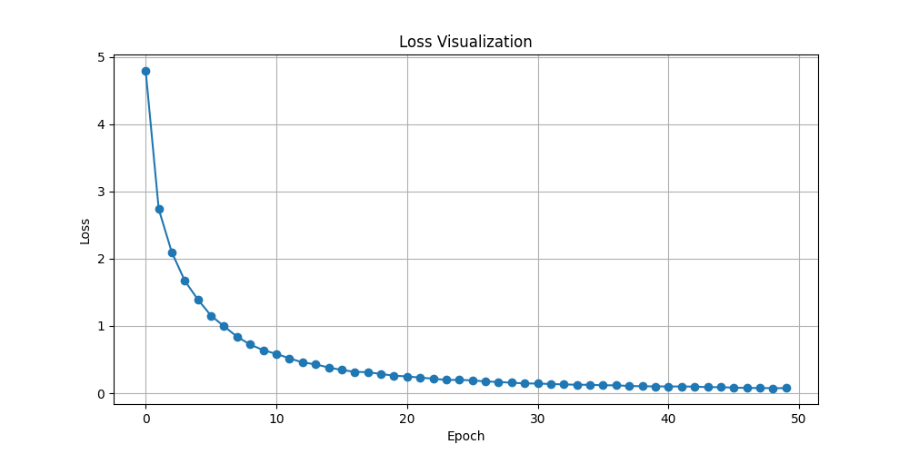
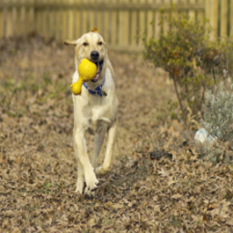
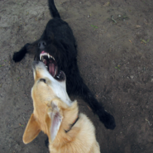

# Generate descriptive text based on the image's content

## 1. Environment
This project runs on ```Google Colab```, and the execution results can be found in ```Image2Text.ipynb```.   


## 2. Dataset
This project uses the ```SynCap-Flickr8k```[Dataset](https://huggingface.co/datasets/kargwalaryan/SynCap-Flickr8k) from Hugging Face for training.
> Using the dataset requires Hugging Face's user access tokens. You can refer to: [[Link]](https://huggingface.co/docs/hub/security-tokens)


## 3. Training
```python train.py```

You can change the following parameters in the code.
```
emb_dim    : Embedding Dimension
lr         : Learning Rate
epochs     : Number of Epochs
batch_size : Batch Size
```




## 4. Testing  
```python test.py```  
The results will be saved in the ```/results``` folder.  


## 5. Results
<p align="center">Five examples in the testing results.</p>  

<div align="center"">
  
| Images | Generated text |
| :---: | :---: |
|   | A man drives a green jeep over a few jagged rocks.            |
|   | A brown dog playing with a tennis ball.                       |
|  | A baby boy sucks on the sweater arm of the woman holding him. |
|  | A tan dog and a black dog are biting each other in the face.  |
|  | A man has his hand on his head while a speaker is speaking.   |

</div>
